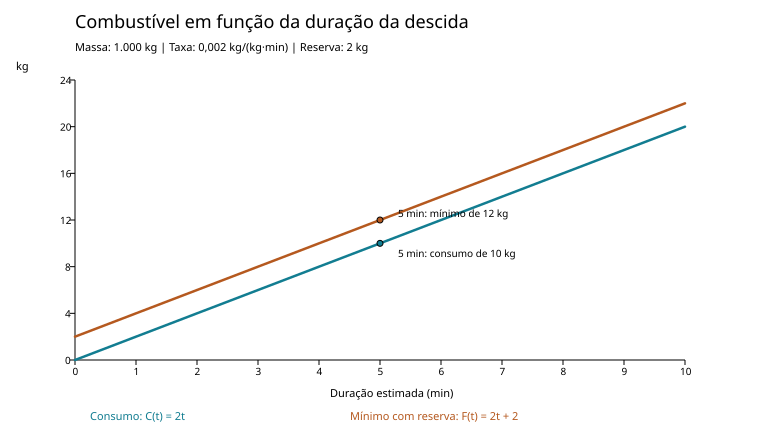

# MGPEB — Módulo de Gerenciamento de Pouso e Estabilização de Base
## Relatório técnico — Aurora Siger

**Atividade Integradora — Fase 2**

**Equipe:** Douglas, Marcelo e Alice

**Versão do protótipo:** 1.2 — outubro de 2026

**Revisão documental:** 6 de outubro de 2026, atualizada em 10 de outubro de 2026

### Resumo

Este relatório apresenta um protótipo didático para organizar a autorização de pouso de módulos destinados à base Aurora Siger, em Marte. O programa cadastra módulos, recebe chegadas e eventos, verifica condições mínimas, organiza candidatos por urgência e dependência, estima consumo de combustível e registra decisões. A implementação usa listas e laços explícitos para praticar os conteúdos da disciplina.

O projeto não é um simulador aeroespacial validado. Seus coeficientes e cenários são hipóteses didáticas. Em particular, o código atual não calcula altitude, velocidade, trajetória, arrasto, temperatura ou frenagem real. Essa delimitação evita confundir uma regra computacional demonstrativa com uma previsão de engenharia.

### Premissas do cenário

Adota-se que uma nave de transporte permanece em órbita de Marte e libera módulos autônomos para pouso individual. Cada módulo possui massa, combustível de descida, sensores, sistemas e horário estimado de chegada próprios. A missão acompanha a ordem de chegada e autoriza no máximo um pouso por vez na área representada pelo protótipo. Esta arquitetura é uma escolha da equipe para preencher uma ambiguidade do enunciado, não uma exigência expressa nele.

A fila considera cinco tipos de módulo: Energia, Habitação, Logística, Médico e Laboratório. A ordem padrão é definida pelas dependências da base. Módulos pousados não são automaticamente considerados operacionais: o de Energia precisa estar funcional para ativar os demais; o Laboratório também aguarda Energia e Habitação.

<!-- PAGE BREAK -->

## 1. Cenário e objetivo do sistema

O MGPEB representa a camada de decisão entre a chegada de um módulo à órbita e sua autorização para iniciar uma descida. A pergunta central é: **“Este módulo pode pousar agora, e, entre os autorizados, qual deve ser o próximo?”** São duas decisões diferentes. Segurança determina quem está apto; prioridade determina a ordem apenas entre os aptos.

Os módulos têm identificador, tipo, prioridade, combustível em quilogramas, massa em quilogramas, criticidade da carga, ETA em minutos, estado de sensores, estado de sistemas, resultado de acidente e campos de estado/motivo. O ETA é contado a partir do começo da simulação. Os dados são exemplos para demonstrar o algoritmo e não descrevem hardware real.

| ID | Módulo | Prioridade | Combustível (kg) | Massa (kg) | Criticidade | ETA (min) |
|---|---|---:|---:|---:|---:|---:|
| E | Energia | 1 | 30 | 1.000 | 1 | 0 |
| H | Habitação | 1 | 30 | 1.000 | 1 | 0 |
| G | Logística | 1 | 30 | 1.000 | 1 | 0 |
| M | Médico | 1 | 30 | 1.000 | 1 | 0 |
| L | Laboratório | 1 | 30 | 1.000 | 1 | 0 |

Os valores iguais formam o cenário padrão para observar a ordem por tipo sem diferenças iniciais de massa, combustível ou criticidade. São parâmetros didáticos; os exemplos alteram dados para demonstrar outras situações. Energia sustenta a ativação dos demais módulos, e o Laboratório também depende da Habitação.

O ambiente é compartilhado: o protótipo guarda se a atmosfera está aceitável e se a área está livre, ocupada ou obstruída. Eventos programados podem mudar clima, área, sensores ou sistemas. Como simplificação, uma descida inteira é tratada como uma transição: alterações previstas durante ela são processadas ao seu fim, em ordem de horário e antes do resultado do pouso. Assim, um evento anterior não desfaz um acidente ocorrido depois dele.

### Objetivo

O programa deve demonstrar cadastro, validação de entradas, busca sequencial, ordenação por inserção, fila FIFO, pilha de eventos, condições booleanas e uma função matemática simples. O fluxo é repetível: os dados do cadastro são copiados antes de simular, então uma rodada não consome os valores da próxima.

A versão principal está em `mgpeb.py`. `exemplos.py` contém cenários de teste; `test_mgpeb.py` é uma bateria externa de validação. `main.py` é um experimento anterior de descida física e não participa da lógica atual da fila.

<!-- PAGE BREAK -->

## 2. Estruturas de dados e fluxo (anexo integrado)

Cada módulo é uma lista de 12 posições. Constantes como `ID`, `MASSA` e `COMBUSTIVEL` dão nomes a essas posições. A escolha imita vetores apresentados em aula e deixa visível como cada campo é acessado pelo índice. A função `validar` confere primeiro os tipos das listas e de suas linhas; depois verifica quantidade e tipo dos campos, faixas numéricas e identificadores únicos. Entradas malformadas são rejeitadas com aviso e retorno vazio.

A busca é linear: `buscar` percorre os módulos até encontrar um tipo ou identificador; `buscar_extremo` conserva o índice do menor ou maior valor encontrado. Para cinco módulos, a busca linear é suficiente e simples de explicar. Em uma lista muito maior, seria possível avaliar outras estruturas, mas isso está fora do objetivo didático atual.

A fila `fila` recebe os módulos quando o ETA chega. O primeiro índice é retirado e transferido para `espera`, que conserva os candidatos entre ciclos de decisão. A nova lista `pousados` guarda índices dos módulos que concluíram a descida com sucesso; cada índice aponta para o cadastro original em `dados`, sem duplicar registros. `alertas` guarda o identificador e o motivo de cada bloqueio. A área é reservada antes do pouso. Um pouso bem-sucedido a libera; um cenário de acidente a deixa obstruída.

A lista `aptos` reúne somente módulos aprovados. `ordenar` implementa ordenação por inserção: pega um candidato e desloca os anteriores até encontrar sua posição. O cadastro original não é reordenado. Empates completos mantêm a ordem de entrada, o que torna o resultado previsível.

Um módulo já pousado fica `suspenso` se perder sensores, sistemas ou dependências. A falha de Energia pode suspender os dependentes; um reparo permite reativação, sem novo pouso ou consumo. Acidentes não são recuperados por eventos de reparo. Os estados em solo são recalculados a cada ciclo.

O histórico também é copiado para `pilha`. Seu topo é o registro mais recente, seguindo LIFO. `ultimo_evento` consulta esse topo; `desfazer_consulta` devolve uma nova pilha sem ele. Essa operação demonstra a pilha, mas não desfaz pousos nem altera combustível.

### Exemplo concreto: cenário `urgente`

Energia (E, índice 0) tem 30 kg e Médico (M, índice 1) tem 13 kg; o mínimo seguro é 12 kg. Valores da execução de `exemplos.py`:

```text
0 min   fila -> espera = [0, 1]            E e M, na ordem de chegada
0 min   aptos [0, 1] -> ordenar -> [1, 0]  M urgente: margem 1/12 = 8%
5 min   pousados = [1]      espera = [0]
10 min  pousados = [1, 0]   espera = []    alertas = []
fim     topo da pilha: "10.0 min: rodada encerrada"
        após desfazer_consulta: "M operacional"
```

### Passos de cada ciclo

1. Aplicar eventos vencidos, na ordem do horário.
2. Inserir na fila os módulos cujo ETA chegou.
3. Mover as chegadas para a espera e reavaliar saúde e dependências operacionais.
4. Verificar combustível, sensores, sistemas, atmosfera e área.
5. Se não houver candidatos, avançar o relógio ao próximo ETA ou evento; sem eventos futuros, encerrar com pendências.
6. Ordenar os autorizados, reservar a área, simular a duração e o consumo estimados e registrar o resultado.

<!-- PAGE BREAK -->

## 3. Autorização e prioridade

A regra de segurança é uma conjunção: todas as condições obrigatórias precisam ser verdadeiras. Um motivo vazio em `autorizar` significa que o módulo foi aprovado. Quando alguma condição falha, o programa concatena os motivos para que a equipe saiba por que o módulo permanece aguardando.

```text
C = combustível suficiente para descida e reserva
S = sensores operacionais
E = sistemas operacionais
A = atmosfera aceitável
D = área livre

AUTORIZAR = C AND S AND E AND A AND D
```


Figura 1. Autorização como o código a escreve (`NOT(NOT S OR NOT E) = S AND E`, por De Morgan) e, abaixo, a ativação em solo.

Em `autorizar`, cada condição é um `if` próprio, para registrar a combinação de motivos; a decisão de pousar usa `if`/`else`, e a ativação usa `if`/`elif`/`else` por tipo de módulo.

O protótipo ainda não verifica ângulo de entrada, coordenadas, integridade estrutural ou condição independente do paraquedas. Esses itens surgiram no planejamento inicial da equipe e podem ser incluídos como novos sinais booleanos, com validação e cenários de teste próprios.

### Como a fila escolhe o próximo

A urgência é calculada somente depois da autorização; combustível crítico nunca libera uma descida insegura. Primeiro, calcula-se a margem relativa em relação ao mínimo seguro. Uma margem de até 25% é classificada como urgente. Entre urgentes, vence a menor margem; se empatar, vence a maior criticidade. A ordem padrão por tipo e, por fim, a prioridade numérica desempata os restantes. Sem urgência, usa-se a ordem padrão e depois a prioridade.

O código usa números de prioridade de 1 a 5, em que um número maior significa maior importância, conforme a convenção deste protótipo.

Os 14 cenários incluem operação normal, bloqueios, urgência, ETA futuro, dependências, clima, acidente, falha da Energia e recuperação na base. Os 22 testes do simulador conferem esses comportamentos, entradas malformadas e as 32 combinações booleanas. Uma falha durante a descida é aplicada ao final e pode impedir a ativação na base.

<!-- PAGE BREAK -->

## 4. Modelo matemático: consumo de combustível

A função matemática escolhida estima o combustível necessário para uma descida. Ela é deliberadamente simples e compatível com o conteúdo de funções lineares e afins da disciplina. A taxa é uma hipótese do protótipo, não um valor publicado para um veículo marciano.

```text
C(t) = k * m * t
F(t) = C(t) + R
```

Onde:

- `taxa` é a taxa hipotética de consumo em kg/(kg·min);
- `massa` é a massa do módulo em kg;
- `duração` é o tempo estimado de descida em minutos;
- `reserva` é uma quantidade fixa de combustível em kg.

Os símbolos `C(t)` e `F(t)` representam, respectivamente, o consumo estimado e o mínimo com reserva. `k` é a taxa hipotética; `m` é a massa; `t` é a duração; e `R` é a reserva. A unidade de `k * m * t` resulta em quilogramas.

| Parâmetro | Valor usado | Unidade/significado |
|---|---:|---|
| k | 0,002 | kg/(kg·min), taxa hipotética |
| m | 1.000 | kg, massa do módulo padrão |
| t | 5 | min, duração estimada |
| R | 2 | kg, reserva fixa |

Com os parâmetros do programa (`taxa = 0,002`, `duração = 5 min`, `reserva = 2 kg`) e um módulo de 1.000 kg, o consumo estimado é `0,002 × 1.000 × 5 = 10 kg`. O mínimo seguro fica em `10 + 2 = 12 kg`. Um módulo com menos de 12 kg é bloqueado; a reserva não é consumida na simulação.

Para massa e taxa fixas, o consumo cresce linearmente com a duração. No gráfico de consumo por duração, a reta parte de zero e sua inclinação é `taxa × massa`. Para o mínimo seguro, a reta tem a mesma inclinação, mas começa no valor da reserva. Aumentar massa ou duração aumenta o consumo e o mínimo; aumentar a reserva desloca para cima a reta do mínimo sem alterar sua inclinação.



Figura 2. Consumo estimado e mínimo com reserva para massa de 1.000 kg. Elaborado a partir da fórmula e dos parâmetros do protótipo.

| Duração (min) | Consumo C(t) (kg) | Mínimo F(t) (kg) |
|---:|---:|---:|
| 0 | 0 | 2 |
| 2 | 4 | 6 |
| 5 | 10 | 12 |
| 10 | 20 | 22 |

Na configuração padrão, a urgência usa a margem `(combustível disponível - F(5)) / F(5)`. Como `F(5) = 12 kg`, a faixa urgente é de 12 a 15 kg, inclusive: abaixo de 12 kg o módulo é bloqueado; até 25% acima do mínimo ele pode ser priorizado entre os autorizados.

Essa função ajuda a comparar combustível disponível com uma necessidade estimada e a justificar a fila por margem relativa, em vez de comparar apenas quilogramas brutos entre módulos diferentes. Ela não modela empuxo, gravidade, arrasto, altitude ou velocidade; portanto, não permite afirmar que o módulo tocará o solo a uma velocidade específica. Os parâmetros devem ser apresentados como hipótese didática.

<!-- PAGE BREAK -->

## 5. Contextualização do MGPEB à luz da evolução da computação

### Dos computadores de propósito geral aos sistemas embarcados

Os primeiros computadores eletrônicos de propósito geral demonstraram que uma mesma máquina poderia executar diferentes sequências de operações para resolver problemas. O ENIAC é um exemplo desse período: utilizava válvulas e sua programação inicial envolvia a configuração de conexões e chaves. Embora permitisse automatizar cálculos, seu porte e suas necessidades de operação estavam distantes das exigências de um equipamento instalado em uma nave. [1].

A evolução das válvulas para transistores e circuitos integrados contribuiu para reduzir o tamanho dos equipamentos e ampliar as possibilidades de processamento. Essa transformação permitiu incorporar computadores a máquinas e veículos. Nesses sistemas embarcados, o processamento atende funções específicas, como interpretar sensores e comandar equipamentos. O Apollo Guidance Computer exemplifica essa aplicação espacial: participou dos cálculos de orientação, navegação e controle das missões Apollo. A confiabilidade, porém, depende também de projeto, testes e mecanismos de recuperação, e não apenas da miniaturização. [2].

O MGPEB representa didaticamente essa integração entre dados e decisões. Ele recebe informações dos módulos e do ambiente, verifica condições obrigatórias, organiza os candidatos ao pouso e registra os resultados. As expressões booleanas permitem transformar critérios de segurança em decisões verificáveis. Por exemplo, um módulo com prioridade elevada continua bloqueado quando seus sensores são indicados como falhos. O programa simula essas informações; não recebe sinais de sensores reais nem controla uma nave.

### Limitações de hardware em uma missão a Marte

Uma missão espacial precisa equilibrar capacidade de processamento, memória, energia disponível e resistência ao ambiente. Como exemplo concreto, o Perseverance utiliza um processador RAD750 tolerante à radiação, com operação de até 200 MHz, 256 MB de memória dinâmica e 2 GB de memória flash. Possui dois elementos computacionais, permitindo recorrer a uma unidade reserva. Esses valores caracterizam esse rover, sem estabelecer uma configuração obrigatória para a base Aurora. [3].

Para o MGPEB, essas restrições sugerem cuidados distintos. A memória limita o volume de módulos, alertas e eventos que pode permanecer armazenado. O processamento disponível limita o trabalho realizável em cada ciclo de decisão. O consumo de energia e o controle de temperatura exigem planejamento das atividades dos equipamentos. A exposição à radiação demanda componentes adequados e estratégias para lidar com falhas. O exemplo do Perseverance reúne proteção à radiação, redundância e monitoramento de energia e temperatura. [3].

<!-- PAGE BREAK -->

### 5.1. Limitações de hardware e escolhas do protótipo

Na implementação atual, cada módulo é representado por uma lista de atributos. A fila organiza a entrada dos módulos conforme sua chegada; em seguida, os candidatos aptos são ordenados pelas regras do projeto. Listas auxiliares registram espera, pousos e alertas. A pilha permite consultar os eventos do mais recente para o mais antigo. Essas estruturas tornam o fluxo compreensível e permitem acompanhar manualmente uma simulação pequena.

A busca linear percorre os registros até encontrar o módulo desejado. Quando se procura um valor extremo, o programa compara os elementos sem precisar ordenar toda a coleção. A ordenação por inserção reorganiza os índices dos candidatos aptos, preservando o cadastro principal. Para o cenário de cinco módulos, essas escolhas favorecem a compreensão e a revisão das regras. Se a quantidade de módulos aumentar, a ordenação por inserção poderá exigir um número de comparações que cresce aproximadamente com o quadrado da quantidade de candidatos, no pior caso.

O código também possui custos que precisam ser reconhecidos: a função `quantidade` percorre a lista para contar elementos, várias operações concatenam ou reconstroem listas e o histórico acumula eventos. Portanto, a simplicidade didática não comprova eficiência de memória ou de processamento. Uma adaptação para hardware limitado precisaria medir esses custos, reduzir cópias desnecessárias e definir limites de armazenamento e uma política de preservação dos registros importantes.

A organização em funções de validação, autorização, busca e ordenação facilita a identificação de erros. A verificação dos dados antes da simulação e os testes de cenários adversos contribuem para avaliar o comportamento do protótipo. Entretanto, os indicadores booleanos de sensores e sistemas apenas representam condições simuladas: não implementam redundância física, correção de erros de memória ou tolerância à radiação. Assim, o MGPEB permite estudar princípios de organização e confiabilidade, enquanto um sistema de voo exigiria desenvolvimento e validação específicos.

<!-- PAGE BREAK -->

## 6. Princípios ESG na concepção da base Aurora

### Ambiental: área de pouso e recursos

Propõe-se escolher a área de pouso considerando estabilidade e inclinação do terreno, obstáculos, distância das instalações e dispersão de poeira e detritos. A equipe também deve identificar regiões de interesse científico, evitando que pousos, descarte ou extração comprometam observações e amostras. A proteção planetária busca evitar contaminação biológica de outros corpos por material terrestre e contaminação da Terra em missões de retorno [4]. Para a Aurora, esse princípio orienta limpeza dos equipamentos, contenção de resíduos e separação entre áreas operacionais e científicas.

A gestão energética proposta deve acompanhar geração, armazenamento e consumo, mantendo reserva para suporte à vida, comunicação e operações críticas. Experimentos e produção adiáveis devem acompanhar a disponibilidade de energia. Se houver painéis solares, períodos de baixa geração e manutenção precisam entrar no planejamento. O protótipo representa a dependência do módulo Energia, mas não calcula eletricidade ou baterias.

Para água, materiais e resíduos, propõem-se controle de estoques, redução de desperdícios, recuperação tecnicamente viável e separação dos resíduos que exigem contenção. A produção deve priorizar necessidades justificadas e reparos. Extrair recursos locais exige avaliar energia consumida, resíduos e alteração do terreno: a origem local, isoladamente, não garante sustentabilidade.

### Social: segurança e necessidades essenciais

As prioridades devem considerar necessidades da comunidade, consequências da perda de cargas e dependências entre módulos. No MGPEB, urgência de combustível influencia somente a ordem dos candidatos aptos; não elimina bloqueios de segurança. Isso exemplifica como atender necessidades urgentes sem ignorar condições obrigatórias.

Para a base, propõem-se treinamento, procedimentos acessíveis, divisão de responsabilidades e canais para relatar falhas sem retaliação. Representantes das áreas médica, técnica, científica e de habitação devem participar da definição de prioridades, considerando quem depende de atendimento e recursos essenciais. Influência pessoal não deve substituir critérios conhecidos.

### Governança: transparência e participação

A governança deve definir quem estabelece regras, autoriza mudanças e revisa ocorrências. Propõe-se registrar a justificativa de alterações nos limites de segurança e exigir revisão por outro responsável. Emergências devem seguir procedimentos previamente acordados, com análise posterior das decisões.

O MGPEB registra eventos, estados e motivos de bloqueio, mas o histórico fica em memória e não é um registro permanente protegido contra alterações. Como evolução, propõe-se armazenar horário, módulo, motivo e versão das regras de cada decisão, com critérios de acesso, preservação e revisão. Dados pessoais e médicos devem ter acesso restrito, enquanto os critérios gerais permanecem transparentes.

Indicadores propostos incluem energia disponível para emergências, recuperação de água, resíduos armazenados, incidentes e bloqueios por motivo. Sua revisão periódica, com participação dos ocupantes, deve orientar correções. Essas diretrizes ESG são propostas de concepção da base; o código atual não implementa gestão ambiental, votação ou auditoria persistente.

<!-- PAGE BREAK -->

## 7. Conclusão, limites e referências

O protótipo demonstra a organização de módulos, a fila de chegadas, buscas, ordenação por inserção, regras AND, eventos, dependências e pilha de histórico. A função afim do combustível mínimo com reserva conecta um fenômeno operacional a uma decisão de autorização. Os testes verificam os cenários previstos e ajudam a detectar regressões. O roteiro `avaliar.py` permite escolher terminal ou painel e voltar ao menu após cada execução, com opção de sair. Como complemento, um painel HTML (`painel/index.html`) reproduz os 14 cenários e o padrão de forma animada; ele só exibe as decisões tomadas pelo `mgpeb.py`, exportadas por `exportar_painel.py`.

O principal limite é físico: não se calculam a trajetória ou a velocidade real de pouso. Os parâmetros de consumo, duração, margem de urgência e ordem dos módulos são hipóteses da equipe. Antes de ampliar o modelo, a equipe deve escolher quais dados deseja representar, definir unidades, buscar valores justificáveis e adicionar testes para cada regra nova. Uma próxima evolução possível é incluir um modelo de temperatura interna com potência térmica e capacidade térmica, mantendo-o separado da autorização de pouso.

### Referências

[1] COMPUTER HISTORY MUSEUM. **ENIAC**. Disponível em: https://www.computerhistory.org/revolution/story/78 . Acesso em: 6 out. 2026.

[2] NASA. **High Performance Spaceflight Computing**. Disponível em: https://www.nasa.gov/directorates/stmd/nasa-industry-advance-high-performance-spaceflight-computing/ . Acesso em: 6 out. 2026.

[3] NASA. **Perseverance Rover Components**. Disponível em: https://science.nasa.gov/mission/mars-2020-perseverance/rover-components/ . Acesso em: 6 out. 2026.

[4] NASA/JPL. **Planetary Protection**. Disponível em: https://planetaryprotection.jpl.nasa.gov/ . Acesso em: 6 out. 2026.

**Observação:** as fontes sustentam os exemplos históricos e espaciais. As regras do simulador e as propostas de gestão da base são hipóteses didáticas da equipe. A seção 2 constitui o anexo de estruturas de dados integrado ao relatório.
