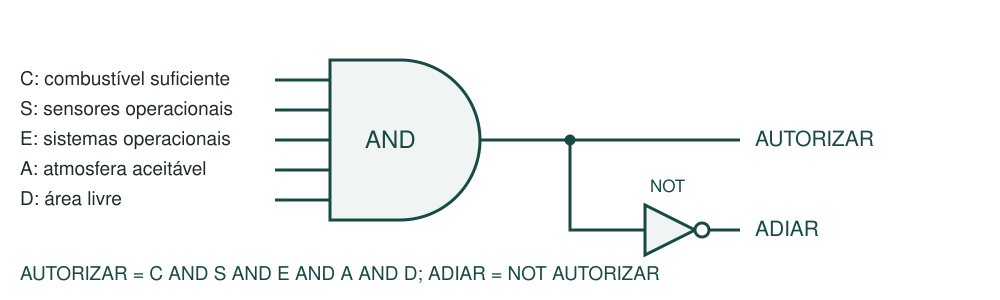

# Entendendo o MGPEB
## Guia metódico do projeto e das correções da versão 1.1

**Projeto:** Aurora Siger | Atividade Integradora FIAP - Fase 2

**Data:** 6 de outubro de 2026

### 1. O problema que estamos resolvendo

Imagine que cinco módulos chegam à órbita de Marte para montar uma base. Existe uma área de pouso compartilhada. Os módulos podem chegar em momentos diferentes, ter quantidades diferentes de combustível ou apresentar falhas. O MGPEB organiza quem pode iniciar uma descida e quem deve ser atendido primeiro. Depois, acompanha se os módulos pousados conseguem operar na base.

O programa responde a três perguntas, nesta ordem: o módulo pode pousar com as condições atuais? Entre os que podem, qual deve pousar primeiro? Depois de pousar, ele está saudável e tem as dependências necessárias para operar? Separar essas perguntas evita tratar prioridade como autorização ou pouso como funcionamento garantido.

Este é um protótipo didático. Ele simula decisões com listas e condições, sem calcular uma trajetória real. Um pouso leva um tempo fixo e consome uma quantidade estimada de combustível. O cenário indica se haverá acidente; o programa não calcula a probabilidade de falha.

### Como estudar este guia

A sequência acompanha o funcionamento do programa: dados de entrada, validação, fluxo, lógica, matemática, prioridade, estruturas, operação da base e testes. Os exemplos usam os parâmetros existentes, para que você possa executar e comparar. As últimas partes explicam as correções e a relação com o trabalho acadêmico.

O relatório técnico principal é o documento de entrega, limitado a 5 a 10 páginas. Este guia é um material de estudo separado, mais detalhado, e não deve ser somado automaticamente ao PDF acadêmico.

### O que mudou nesta rodada

Foram corrigidas a validação de entradas malformadas e a manutenção incorreta do estado operacional após falhas. Também foram atualizados os exemplos salvos, acrescentados testes e substituído o esquema textual por um diagrama gráfico de portas. As regras de prioridade e a fórmula de combustível foram preservadas.

<!-- PAGE BREAK -->

## 2. Os arquivos e os dados do projeto

### Onde está cada responsabilidade

| Arquivo | Função |
|---|---|
| mgpeb.py | Simulador atual: valida, organiza, autoriza, pousa e reavalia a base |
| exemplos.py | Monta e executa 14 cenários de estudo |
| test_mgpeb.py | Confere automaticamente os resultados e restrições didáticas |
| exemplos_saida.txt | Saída dos cenários, salva em UTF-8 |
| RELATORIO_TECNICO.md / .pdf | Documento acadêmico editável e versão de leitura |
| gerar_relatorio_pdf.py | Converte os documentos e seus gráficos SVG para PDF |
| main.py | Experimento anterior de descida; não é o simulador atual |
| ROADMAP.MD | Anotações históricas e ideias; nem tudo foi implementado |

### Como um módulo é representado

Cada módulo é uma lista de 12 posições. Constantes dão nomes aos índices: `COMBUSTIVEL = 3` permite escrever `m[COMBUSTIVEL]` em vez de depender da memorização do número 3. Os dois acessos chegam ao mesmo campo.

| Índice | Campo | Significado |
|---|---|---|
| 0 | ID | Identificador textual único, como E ou M |
| 1 | TIPO | Energia, Habitação, Logística, Médico ou Laboratório |
| 2 | PRIORIDADE | Inteiro de 1 a 5; maior significa mais importante |
| 3 | COMBUSTIVEL | Quantidade disponível em kg |
| 4 | MASSA | Massa constante do módulo, em kg |
| 5 | CARGA | Criticidade de 1 a 5; maior representa maior consequência da perda |
| 6 | ETA | Instante de chegada à órbita, em minutos desde o início |
| 7 e 8 | SENSORES / SISTEMAS | True se saudáveis; False se falhos |
| 9 | ACIDENTE | Resultado de acidente definido pelo cenário |
| 10 e 11 | ESTADO / MOTIVO | Situação do módulo e explicação de uma pendência |

Por exemplo, `["M", "Médico", 1, 13.0, 1000.0, 5, 0.0, True, True, False, "", ""]` representa um módulo médico que chega no instante zero, tem 13 kg de combustível e carga muito crítica. A simulação redefine o estado inicial para órbita e preserva o cadastro original por meio de cópias.

<!-- PAGE BREAK -->

## 3. Ambiente, parâmetros e validação

### Dados compartilhados

O ambiente tem dois campos: `[atmosfera_aceitavel, situacao_area]`. O exemplo `[True, "livre"]` indica atmosfera aceitável e área disponível. As entradas aceitas para a área são livre, ocupada e obstruída. Durante a simulação, reservada é um estado interno temporário, definido antes da descida.

A configuração padrão é `[5.0, 0.002, 2.0, 0.25]`. Esses valores significam duração de 5 minutos, taxa hipotética de consumo de 0,002 kg/(kg·min), reserva de 2 kg e margem relativa de urgência de 25%. A taxa não é um dado real de engenharia espacial.

### Por que validar antes de simular

O algoritmo acessa campos por posição. Se receber um número no lugar de uma lista, não pode percorrê-lo ou consultar seus índices. Antes da correção, uma entrada como `[42]` podia chegar à função que conta elementos e causar um erro. Agora, a ordem da validação é: conferir o tipo do contêiner, conferir seu tamanho e só então acessar e avaliar os campos.

São exigidas listas para módulos, eventos, ambiente e configuração; cada linha de módulo ou evento também deve ser lista. Um módulo precisa dos 12 campos e um evento precisa de quatro. Identificadores devem ser textos não vazios e únicos. Os campos de estado e motivo também devem ser textos, mesmo que sejam redefinidos na cópia usada pela simulação.

Massa deve ser positiva; combustível e ETA não negativos. Prioridade e criticidade são inteiros de 1 a 5. Sensores, sistemas e acidente devem ser booleanos: o número 1 não é aceito como substituto de True. A função `numero_valido` rejeita NaN, infinito e números fora da faixa didática de zero até menos de um bilhão. Duração, taxa e reserva precisam ser positivas; a margem de urgência pode ser zero.

### O resultado de uma entrada inválida

`simular` imprime uma mensagem orientando a conferência dos campos e retorna `[]`. Isso sinaliza que não houve simulação válida. Uma simulação válida sem módulos, por outro lado, retorna a estrutura de resultado com suas listas vazias; não é o mesmo caso.

A proteção é aplicada à entrada de `simular`. Funções auxiliares, como `quantidade` e `autorizar`, pressupõem dados compatíveis quando chamadas isoladamente. Não se trata de uma camada genérica capaz de aceitar qualquer objeto Python.

<!-- PAGE BREAK -->

## 4. O ciclo da simulação

### A sequência de decisões

1. Validar as entradas e copiar os registros dos módulos.
2. Começar o relógio no instante zero.
3. Aplicar eventos cujo horário já chegou, em ordem cronológica.
4. Colocar na fila os módulos que chegaram à órbita e transferi-los para a espera.
5. Reavaliar os módulos em solo: saúde, dependências, suspensão ou recuperação.
6. Avaliar cada módulo em espera e formar a lista dos aptos.
7. Ordenar os aptos, escolher o primeiro e reservar a área.
8. Descontar o consumo, avançar o tempo da descida e registrar pouso ou acidente.
9. Repetir até não haver candidatos nem acontecimentos futuros a processar.

Se nenhum módulo puder pousar agora, o relógio salta para a próxima chegada ou evento. Quando não existe mudança futura prevista, a rodada termina com as pendências existentes. O programa não inventa uma melhora do clima para forçar um final bem-sucedido.

### O cenário normal, passo a passo

No cadastro padrão, E, H, G, M e L chegam no instante zero. Todos têm massa de 1.000 kg, 30 kg de combustível, prioridade 1 e criticidade 1. As condições de segurança são favoráveis. Como não há urgências, vale a ordem dos tipos.

| Intervalo | Descida | O que acontece ao concluir |
|---|---|---|
| 0 a 5 min | E - Energia | Pousa; no ciclo seguinte pode ativar autonomamente |
| 5 a 10 min | H - Habitação | Pousa; pode operar porque Energia já está operacional |
| 10 a 15 min | G - Logística | Pousa e pode operar com Energia |
| 15 a 20 min | M - Médico | Pousa e pode operar com Energia |
| 20 a 25 min | L - Laboratório | Pousa e pode operar com Energia e Habitação |

Ao terminar, os cinco estão operacionais, cada um com 20 kg restantes, e a área está livre. O tempo total é 25 minutos porque as descidas são sequenciais e cada uma dura cinco minutos.

A descida é atômica: um evento marcado no minuto 3 de uma descida entre 0 e 5 é processado no minuto 5. O registro informa tanto o instante de aplicação quanto o horário previsto. Esses eventos são aplicados antes do resultado do pouso, respeitando a ordem dos fatos: um evento de "área livre" no minuto 2 não pode desfazer a obstrução causada por um acidente no minuto 5. Essa hipótese simplifica o exercício, mas não representa controle de voo em tempo real.

<!-- PAGE BREAK -->

## 5. A autorização e as portas lógicas

### A regra de segurança

Cinco condições precisam ser verdadeiras simultaneamente. C significa combustível suficiente para consumo e reserva; S, sensores saudáveis; E, sistemas saudáveis; A, atmosfera aceitável; D, área livre. A expressão é `AUTORIZAR = C AND S AND E AND A AND D`.



Figura 1. A porta AND reúne as condições obrigatórias. A porta NOT representa a decisão de adiar quando a autorização é falsa.

| Situação | Resultado |
|---|---|
| C, S, E, A e D verdadeiros | Autorizar |
| Qualquer uma dessas condições falsa | Adiar ou manter aguardando |
| Prioridade alta, mas sensores falhos | Manter aguardando |
| Combustível urgente, mas abaixo do mínimo | Manter aguardando |

### Como isso aparece no Python

A função `autorizar` começa com um motivo vazio. Cada condição reprovada acrescenta uma explicação ao texto. Se o texto continuar vazio, o módulo está apto. Os vários comandos `if` permitem registrar todos os problemas, sem parar no primeiro. Um módulo pode apresentar combustível insuficiente e sensores falhos ao mesmo tempo.

O trecho `not m[SENSORES] or not m[SISTEMAS]` detecta que pelo menos um desses componentes está falho. Para autorizar, ambos precisam estar saudáveis. Essa forma de testar bloqueios é coerente com o AND apresentado no diagrama. O programa não precisa de uma variável chamada ADIAR: ele mantém o módulo aguardando quando existe motivo.

### O que o novo desenho acrescenta

O esquema anterior usava apenas caracteres de texto. O novo SVG mostra o símbolo curvo da porta AND e o triângulo com círculo da porta NOT, além das entradas e saídas. O arquivo é vetorial, preservando legibilidade ao ampliar o PDF. Ele representa a mesma regra do código, sem criar uma condição nova.

As cinco entradas geram 32 combinações possíveis. A suíte testa todas: somente a combinação em que as cinco são verdadeiras autoriza o pouso.

<!-- PAGE BREAK -->

## 6. O combustível e a função matemática

### Consumo e mínimo são quantidades diferentes

O consumo estimado é `C(t) = k × m × t`. O mínimo exigido acrescenta uma reserva: `F(t) = k × m × t + R`. A primeira função é linear em t; a segunda é afim, pois tem um termo constante. A letra C desta fórmula significa consumo; no diagrama lógico, C é um indicador booleano. O contexto diferencia os dois usos.

| Símbolo | Significado | Valor padrão |
|---|---|---|
| k | Taxa hipotética de consumo | 0,002 kg/(kg·min) |
| m | Massa constante | 1.000 kg |
| t | Duração da descida | 5 min |
| R | Reserva que deve permanecer | 2 kg |

Assim, `C(5) = 0,002 × 1.000 × 5 = 10 kg`. O mínimo é `F(5) = 10 + 2 = 12 kg`. Um módulo com 12 kg pode descer e terminar com 2 kg. Um módulo com 11 kg não atende à reserva e fica bloqueado. O combustível descontado é 10 kg; não se desconta também a reserva.

### Como nasce a urgência

A margem relativa é `(combustível disponível - mínimo) / mínimo`. Ela compara a sobra com a necessidade daquele módulo. No cenário padrão, o limite de urgência é 0,25. Portanto, entre os aptos, combustível de 12 a 15 kg indica urgência, inclusive nos dois extremos.

| Combustível | Autorização pelo combustível | Margem e classificação |
|---|---|---|
| 11,999 kg | Bloqueado | Abaixo do mínimo |
| 12 kg | Apto | 0%; urgente |
| 13 kg | Apto | Aproximadamente 8,33%; urgente |
| 15 kg | Apto | 25%; urgente |
| 15,001 kg | Apto | Acima de 25%; não urgente |

Isso explica por que simplesmente escolher o menor combustível bruto seria inadequado. Um módulo mais pesado pode precisar de mais combustível. O critério compara a margem relativa, considerando sua massa na fórmula.

### Limites da interpretação

Massa e taxa ficam constantes; não há cálculo de empuxo, arrasto, altitude ou velocidade. Esperar em órbita não consome combustível. A fórmula permite discutir uma regra operacional e a análise de funções, sem prever um pouso físico real. Dobrar a massa ou a duração dobra o consumo estimado, mas a reserva continua fixa.

<!-- PAGE BREAK -->

## 7. Quem pousa primeiro e por que

### Segurança vem antes da ordenação

A função `ordenar` recebe apenas índices de candidatos já autorizados. Um módulo bloqueado não vence a disputa, independentemente da prioridade. A função `vem_antes` responde se um candidato deve preceder outro usando a sequência abaixo.

1. Se apenas um é urgente, ele vem primeiro.
2. Se ambos são urgentes, comparar a margem: a menor vem primeiro.
3. Se as margens dos urgentes empatam, comparar a criticidade: a maior vem primeiro.
4. Persistindo o empate, comparar a ordem padrão dos tipos.
5. Dentro do mesmo tipo, comparar a prioridade numérica: a maior vem primeiro.
6. Empate completo conserva a ordem de entrada.

Quando nenhum dos dois é urgente, a comparação começa pela ordem dos tipos, depois pela prioridade. A criticidade não é um critério geral para todos os casos; ela participa do desempate entre urgentes com margens iguais. Isso descreve a regra escolhida, e não uma obrigação universal de uma missão espacial.

### Exemplo de urgência

Energia tem 30 kg e Médico tem 13 kg, ambos com massa de 1.000 kg. Os dois são aptos, mas Médico tem margem de aproximadamente 8,33% e Energia de 150%. Médico desce primeiro, termina com 3 kg e aguarda Energia para operar. Depois da descida de Energia, ambos podem ser ativados. A urgência mudou o pouso, mas não apagou a dependência operacional.

### Exemplo de prioridade numérica

Habitação com prioridade 1 ainda pode preceder Médico com prioridade 5 quando nenhum é urgente, porque o tipo é comparado antes. Já entre dois módulos Médicos sem urgência, a prioridade 5 precede a 1. Na apresentação, é importante explicar essa convenção para não prometer uma ordenação global apenas por prioridade.

### Como a ordenação por inserção funciona

O algoritmo percorre os índices dos aptos a partir do segundo. Guarda o candidato atual, desloca para a direita os que deveriam vir depois e insere o candidato na posição aberta. O cadastro dos módulos não muda de ordem. Como só há deslocamento quando `vem_antes` retorna True, empates completos preservam a ordem anterior.

É uma escolha compreensível para uma lista pequena. No pior caso, o número de comparações cresce aproximadamente com o quadrado da quantidade de candidatos. A justificativa principal aqui é didática.

<!-- PAGE BREAK -->

## 8. Listas, fila, pilha e buscas

### Cada estrutura tem um papel

`dados` contém os registros copiados. `fila` recebe os índices das chegadas e os transfere em ordem FIFO para `espera`. `aptos` é reconstruída a cada ciclo com os candidatos seguros. `pousados` conserva os índices dos pousos bem-sucedidos. `alertas` guarda mensagens de ocorrências; `historico` acompanha eventos e transições.

A fila FIFO não determina sozinha a ordem final de pouso. Ela ordena a entrada; a espera é reavaliada, e os aptos são ordenados pelas regras da seção anterior. Essa distinção é necessária para explicar como uma fila de chegada convive com prioridade e urgência.

Armazenar o índice de um módulo evita repetir seus 12 campos em todas as listas. Se `pousados` contém 0, esse número aponta para `dados[0]`. Mesmo que esse registro depois fique suspenso, o índice continua em pousados: o fato histórico de ter pousado permanece verdadeiro.

### As buscas

`buscar(lista, campo, valor)` percorre os registros até encontrar uma igualdade, devolvendo o índice da primeira ocorrência. Se não houver correspondência, devolve -1. Por exemplo, buscar o tipo Médico no cadastro padrão devolve 3. Esse resultado é posição, não quantidade de módulos nem ID.

`buscar_extremo` mantém o índice do melhor candidato encontrado até aquele momento. Pode localizar menor combustível ou maior prioridade sem ordenar a lista. Em caso de valores iguais, preserva a primeira ocorrência. Na lista vazia, retorna -1.

### A pilha

Ao encerrar, o histórico é copiado para `pilha`. O último evento fica no topo. `ultimo_evento` consulta esse registro; `desfazer_consulta` devolve uma nova lista sem ele. Para atualizar a pilha de consulta, é necessário atribuir o retorno a `resultado[4]`. Essa operação não desfaz um pouso nem devolve combustível.

### Custos que precisamos reconhecer

A inclusão `lista + [valor]` cria uma nova lista. `retirar` reconstrói os elementos que restam. `quantidade` conta com um laço, em vez de consultar o tamanho diretamente. A pilha duplica o conteúdo do histórico. Essas operações tornam a manipulação explícita para estudo, mas geram trabalho e memória adicionais. Não há base para afirmar que essa implementação já é otimizada para um computador espacial.

<!-- PAGE BREAK -->

## 9. Pousar, operar, suspender e recuperar

### Os estados do módulo

| Estado | Significado |
|---|---|
| órbita | Ainda não entrou na espera conforme seu ETA |
| espera | Já chegou e aguarda autorização e seleção |
| descendo | Está na transição de pouso, com a área reservada |
| pousado | Chegou ao solo e ainda aguarda dependências para operar |
| operacional | Está saudável e com dependências satisfeitas |
| suspenso | Está no solo, mas falhou ou perdeu uma dependência após operar |
| acidente | Resultado de acidente definido no cenário; não é recuperado automaticamente |

Uma falha própria pode colocar um recém-pousado diretamente em suspenso. Quem nunca operou e apenas espera Energia continua pousado. Quem já operou e perdeu Energia fica suspenso. Essa distinção ajuda a explicar o que aconteceu, embora ambos estejam fisicamente no solo.

### Dependências escolhidas para a base

Energia saudável ativa autonomamente. Habitação, Logística e Médico dependem de pelo menos um módulo Energia operacional. Laboratório precisa também de Habitação operacional. Sensores e sistemas devem estar saudáveis para qualquer módulo operar. Com dois módulos Energia, a falha de um não interrompe os dependentes se o outro permanecer disponível.

### Como a correção funciona

A versão anterior só tentava ativar registros no estado pousado. Se um módulo já estivesse operacional e recebesse `sistemas=False`, seu estado podia continuar operacional. Agora, `ativar` guarda os estados anteriores e reavalia todos os registros em solo.

Primeiro, prepara os módulos para uma nova avaliação e identifica falhas próprias. Depois, ativa os saudáveis cujas dependências já podem ser satisfeitas. Repete essa passagem até não haver novas ativações: isso permite avaliar o cadastro mesmo quando Laboratório aparece antes de Energia na lista. Finalmente, marca como suspensos os que já operavam e perderam uma dependência.

Esse recálculo é uma operação interna do ciclo; o programa não está ordenando que os equipamentos físicos desliguem a cada passagem. O histórico registra apenas transições reais, não as etapas temporárias do recálculo.

Um evento de reparo muda o indicador para True. Se todas as condições necessárias estiverem novamente atendidas, a reavaliação restaura a operação. Não há nova entrada na fila, novo pouso ou novo consumo. O estado acidente fica fora desse processo: marcar sistemas=True não reconstrói um módulo acidentado.

<!-- PAGE BREAK -->

## 10. Um caso completo de falha e recuperação

### Formato dos eventos

Cada evento é `[instante, tipo, valor, ID]`. Para clima e área, o ID deve ser texto vazio, pois a alteração é global. Para sensores e sistemas, o ID precisa identificar um módulo cadastrado. Tipos desconhecidos e alvos inexistentes são rejeitados na validação.

No exemplo abaixo, a base completa primeiro os cinco pousos normais. Depois recebe os eventos `[26.0, "sistemas", False, "E"]` e `[30.0, "sistemas", True, "E"]`.

| Instante | Evento ou resultado | Consequência |
|---|---|---|
| 25 min | Cinco módulos pousados e operacionais | Cada um tem 20 kg restantes |
| 26 min | Sistemas da Energia ficam falhos | Energia passa a suspenso |
| 26 min | Dependências são reavaliadas | Os quatro demais também ficam suspensos |
| 30 min | Sistemas da Energia são reparados | Energia pode voltar a operar |
| 30 min | Reavaliação das dependências | Habitação, Logística, Médico e Laboratório recuperam operação |
| Fim | Sem chegadas ou eventos futuros | Encerra em 30 min, com cinco pousos registrados |

Os alertas da falha continuam na lista histórica após o reparo. Isso não significa que a falha ainda esteja ativa: o estado e o motivo atuais representam a situação presente, enquanto alertas documentam ocorrências anteriores.

### Uma falha durante a descida

Se Energia inicia às 0 min e seus sensores falham às 3 min, a descida atômica termina às 5 min. O evento é aplicado nesse instante, antes do registro do pouso. O registro aparece como previsto para 3 min e processado em 5 min. Energia consta como pousada, mas fica suspensa sem chegar a operacional. O protótipo não afirma que alterou a trajetória ou evitou um acidente durante o voo.

### Como ler o resultado retornado

`simular` retorna oito elementos: módulos, espera, histórico, alertas, pilha, tempo final, ambiente final e pousados. Por exemplo, `resultado[0][0]` é o primeiro módulo ao final; `resultado[5]` é o tempo; `resultado[7]` são os índices dos que pousaram.

A função `relatorio` apenas imprime essa estrutura. Ela não muda decisões. Por isso, investigar um resultado envolve conferir a sequência do histórico, o estado atual e as pendências, em vez de olhar somente o último texto exibido.

<!-- PAGE BREAK -->

## 11. As correções e as evidências

| Antes | Agora | Motivo |
|---|---|---|
| Um número no lugar de uma linha podia causar TypeError | Os tipos são verificados antes das travessias | Rejeitar entradas malformadas de modo controlado |
| Sistemas falhos podiam coexistir com estado operacional | Saúde e dependências são reavaliadas | Manter estados coerentes com os dados |
| Perda de Energia não suspendia os dependentes ativos | Suspensão e recuperação se propagam pelas dependências | Representar a estabilização da base |
| Saída salva antiga e com codificação incompatível | Saída atual dos 14 cenários em UTF-8 | Permitir comparação reproduzível |
| Diagrama apenas em caracteres | SVG com AND e NOT | Mostrar visualmente a expressão booleana |
| Eventos sem alvo e valor no histórico | Registro inclui tipo, valor, ID e horário previsto | Explicar a causa de uma mudança |

### Como foram testadas

A suíte passou de oito para 17 testes. Um teste pode conter vários casos: a tabela-verdade, por exemplo, percorre 32 combinações. Os testes anteriores continuam aprovados, incluindo ordem normal, urgência, consumo, preservação do cadastro e acidente que obstrui a área.

Os testes novos verificam entradas malformadas nos quatro argumentos e nas linhas, tipos dos campos e alvos de eventos. Conferem os limites de combustível, suspensão por falha da Energia, recuperação sem novo pouso, falha durante a descida, dependências em ordem inversa, ausência de registros repetidos e um módulo Energia alternativo. Também verificam que um acidente não é recuperado por um simples evento de sistemas.

O teste de conservação agora percorre os 14 cenários: a entrada original continua intacta, a espera não tem duplicações e consultar a pilha não modifica o estado da missão. A saída salva é comparada à execução de `exemplos.py`.

### O que os testes não demonstram

Eles não validam física de pouso, esterilização, hardware tolerante à radiação ou segurança de uma nave real. O teste AST verifica convenções didáticas herdadas do projeto, como manter o simulador sem classes ou bibliotecas externas; não comprova que a FIAP proíba esses recursos. A correspondência entre cada trecho e páginas específicas das apostilas ainda depende de consulta ao material original.

O PDF acadêmico permanece com dez páginas. O guia é independente, e ambos são gerados a partir dos respectivos arquivos Markdown.

<!-- PAGE BREAK -->

## 12. Como o projeto se conecta às disciplinas

### Evolução da computação e hardware

A parte 5 do relatório explica como computadores eletrônicos de propósito geral e a miniaturização abriram caminho para sistemas embarcados. Os exemplos históricos e do Perseverance têm referências no relatório técnico. O ponto a defender é a relação entre restrições e escolhas: memória limitada pede controle de registros; processamento limitado exige avaliar o custo dos algoritmos; confiabilidade exige validação e tratamento de falhas.

O nosso programa permite estudar essas decisões com dados pequenos. Ele não simula radiação nem implementa redundância física. A correção de suspensão melhora a coerência do modelo, mas não transforma Python didático em software certificado para voo.

### ESG e governança

A parte 6 propõe critérios para escolher a área de pouso, preservar regiões científicas e planejar energia, água, produção e resíduos. Discute segurança das pessoas e participação de diferentes áreas nas prioridades. Também propõe revisão das regras e registros de decisão que possam ser consultados.

O que já existe no código é uma base limitada: critérios explícitos, motivos de bloqueio, histórico, alertas e agora estados de suspensão e recuperação. Não existem gestão de água, previsão de energia, votação, controle de acesso ou auditoria permanente. Os registros permanecem em memória; a saída textual pode ser salva, mas isso não cria automaticamente um sistema de auditoria protegido contra alterações.

### O que precisa ser explicado na apresentação

A lista padrão dos tipos é uma escolha do cenário. Segurança vem antes de urgência. A criticidade da carga não é a mesma coisa que a prioridade. Pousar não significa operar. A simulação avança por acontecimentos conhecidos e trata a descida como uma etapa indivisível. O consumo em órbita foi desprezado deliberadamente.

Esses limites fazem parte do modelo. Não é necessário ampliar o projeto até representar todas as condições de uma missão real; é necessário que relatório, diagrama, código e exemplos contem a mesma história.

### Pendências de identificação e material

A capa do relatório precisa dos nomes corretos da equipe; eles não foram inventados. O arquivo ROADMAP contém ideias históricas, e main.py é um experimento anterior. Para a entrega, a equipe deve apresentar o fluxo de mgpeb.py e o relatório atual, sem atribuir a eles recursos de protótipos ou propostas que não foram integrados.

<!-- PAGE BREAK -->

## 13. Roteiro para você executar e estudar

### Primeira execução

Na pasta do repositório, execute `python mgpeb.py`. Procure os cinco módulos operacionais, o tempo final de 25 minutos e 20 kg restantes em cada módulo. Leia o histórico para localizar as chegadas, as descidas e as ativações.

Depois execute `python exemplos.py`. Os títulos separam 14 cenários. Compare normal, urgente, falha_energia_base e recuperacao_energia_base. Observe que a urgência muda a ordem dos pousos; a falha na base muda a operação depois deles.

Para conferir a suíte, execute `python -m unittest -v`. O resultado esperado na versão 1.1 é 17 testes aprovados. Os testes ficam fora do código principal, permitindo usar ferramentas de verificação sem aumentar a complexidade do simulador estudado.

### Reproduzir os documentos

```text
python -m pip install -r requirements-relatorio.txt
python gerar_relatorio_pdf.py
```

Para gerar este guia, execute o comando abaixo na pasta do repositório. No terminal do macOS, a barra invertida permite continuar o comando na linha seguinte:

```text
python gerar_relatorio_pdf.py --fonte docs/GUIA_DETALHADO.md \
  --destino docs/GUIA_DETALHADO.pdf --titulo "MGPEB - Guia detalhado"
```

O README também mantém o comando completo em uma única linha. O simulador não precisa instalar ReportLab ou svglib; essas dependências servem para os PDFs. A combinação usada na validação foi Python 3.12, ReportLab 4.4.9 e svglib 2.3.0.

### Exercícios para conferir sua compreensão

1. Diminua o combustível de Médico para 13 kg. Explique por que ele pode pousar antes de Energia e ainda esperar para operar.
2. Use 11 kg no mesmo módulo. Explique por que o combustível menor agora bloqueia a descida em vez de aumentar a prioridade.
3. Compare os cenários de falha e recuperação da Energia. Confira se a lista de pousados e o combustível permanecem iguais.
4. Consulte e retire o topo da pilha. Verifique por que o histórico original e o estado dos módulos não mudam.
5. Coloque um evento durante a descida. Compare o horário previsto com o instante em que ele foi aplicado.

Esses exercícios podem ser feitos alterando cópias dos cenários. Mantenha os exemplos padrão disponíveis para comparar seus resultados. O objetivo é conseguir explicar uma decisão usando os dados, a condição ou o critério que a produziu.
